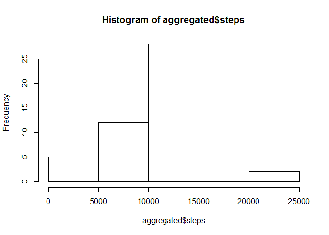
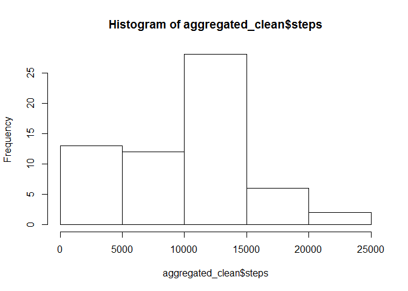
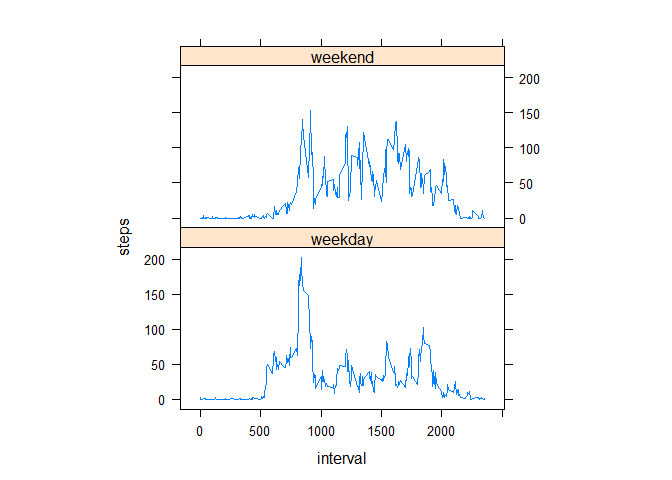

# Reproducible Research: Peer Assessment 1
Oskar Jarczyk  
`r format(Sys.Date(), "%d %B %Y")`  

******

#### Importing libraries


```r
library(sqldf)
```

#### Loading and preprocessing the data

##### Load the data (i.e. read.csv())


```r
dataset <- read.csv("activity.csv", sep=",", header=TRUE)
```

##### Process/transform the data (if necessary) into a format suitable for your analysis
##### Calculate the total number of steps taken per day


```r
aggregated <- sqldf("select date, sum(steps) as steps from dataset where steps is not NULL group by date order by date asc")
```

#### What is mean total number of steps taken per day?

##### Make a histogram of the total number of steps taken each day


```r
hist(aggregated$steps)
```

<!-- -->

##### Calculate and report the mean and median of the total number of steps taken per day


```r
mean(aggregated$steps)
```

```
## [1] 10766.19
```

```r
median(aggregated$steps)
```

```
## [1] 10765
```

#### What is the average daily activity pattern?

##### Make a time series plot (i.e. type = "l") of the 5-minute interval (x-axis) and the average number of steps taken, averaged across all days (y-axis)


```r
aggregated_interval <- sqldf("select interval, avg(steps) as steps from dataset where interval is not NULL group by interval order by interval asc")
plot(steps~interval, data=aggregated_interval, type="l")
```

<!-- -->

##### Which 5-minute interval, on average across all the days in the dataset, contains the maximum number of steps? 


```r
aggregated_interval[which.max(aggregated_interval$steps),]$interval
```

```
## [1] 835
```

##### Answer - it is the *835th* interval.

#### Imputing missing values

##### Calculate and report the total number of missing values in the dataset (i.e. the total number of rows with NAs)


```r
total_na_rows <- sum(is.na(dataset$steps))
```


```r
total_na_rows
```

```
## [1] 2304
```

##### Answer - total 2304 rows are missing.

##### Devise a strategy for filling in all of the missing values in the dataset. The strategy does not need to be sophisticated. For example, you could use the mean/median for that day, or the mean for that 5-minute interval, etc.


```r
library(randomForest)
my_dummy <- matrix(c(1,2,3, 11,NA,13, 21,22,23), nrow = 3, ncol = 3, byrow = TRUE)
```

##### I'll use na.roughfix method from the CRAN R randomForest package. It calculates missing values in a matrix by median/mode. 


```r
# before na.roughfix
my_dummy
```

```
##      [,1] [,2] [,3]
## [1,]    1    2    3
## [2,]   11   NA   13
## [3,]   21   22   23
```

```r
# after na-values fix
na.roughfix(my_dummy)
```

```
##      [,1] [,2] [,3]
## [1,]    1    2    3
## [2,]   11   12   13
## [3,]   21   22   23
```

##### Create a new dataset that is equal to the original dataset but with the missing data filled in.


```r
dataset_clean <- na.roughfix(dataset)
```

##### Make a histogram of the total number of steps taken each day and calculate and report the **mean** and **median** total number of steps taken per day. Do these values differ from the estimates from the first part of the assignment? What is the impact of imputing missing data on the estimates of the total daily number of steps?


```r
aggregated_clean <- 
  sqldf("select date, sum(steps) as steps from dataset_clean group by date order by date asc")
hist(aggregated_clean$steps)
```

<!-- -->

```r
mean_steps <- mean(aggregated_clean$steps)
median_steps <- median(aggregated_clean$steps)
```


```r
mean_steps
```

```
## [1] 9354.23
```

###### The **mean** total number of steps taken per day is 9354.2295082 steps.


```r
median_steps
```

```
## [1] 10395
```

###### The **median** total number of steps taken per day is 1.0395\times 10^{4} steps.

##### Inputing missing NA values changes estimates in two ways. Mean number of steps is lower, while median is somewhere close to previous estimation. On the histogram, we can see an increase in the (0 - 5000) bucket for the number of steps, which is quite obvious, because there were lot of 'NA' values for the observations representing days of low activity.

#### Are there differences in activity patterns between weekdays and weekends?

##### Create a new factor variable in the dataset with two levels – “weekday” and “weekend” indicating whether a given date is a weekday or weekend day.


```r
dataset_clean$day <- ifelse(
                            as.POSIXlt(as.Date(dataset_clean$date))$wday%%6 != 0,
                            "weekday", "weekend"
                            )
# For Sunday and Saturday : weekend, Other days : weekday 
dataset_clean$day <- factor(dataset_clean$day, levels=c("weekday", "weekend"))
```

##### Make a panel plot containing a time series plot (i.e. type = "l") of the 5-minute interval (x-axis) and the average number of steps taken, averaged across all weekday days or weekend days (y-axis). See the README file in the GitHub repository to see an example of what this plot should look like using simulated data.


```r
steps_interval <- aggregate(steps~interval+day, dataset_clean, mean)
library(lattice)
xyplot(steps~interval|factor(day), data=steps_interval, aspect=1/2, type="l")
```

<!-- -->

